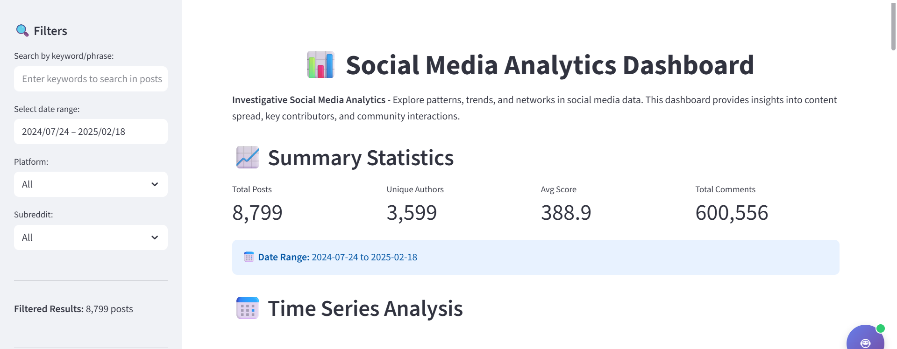
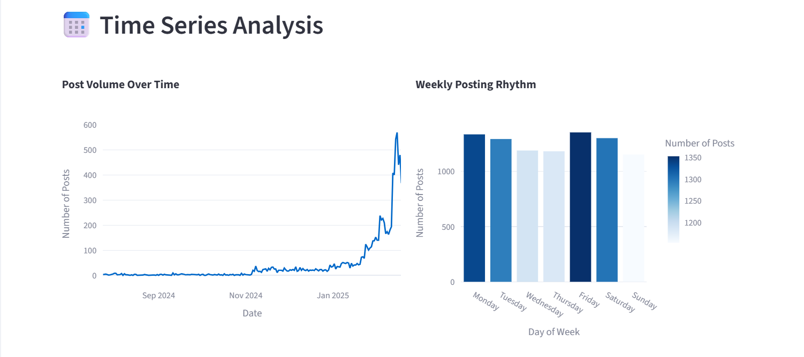
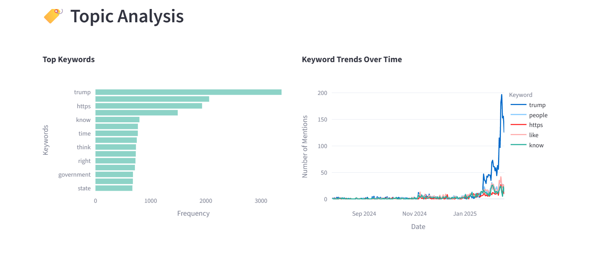
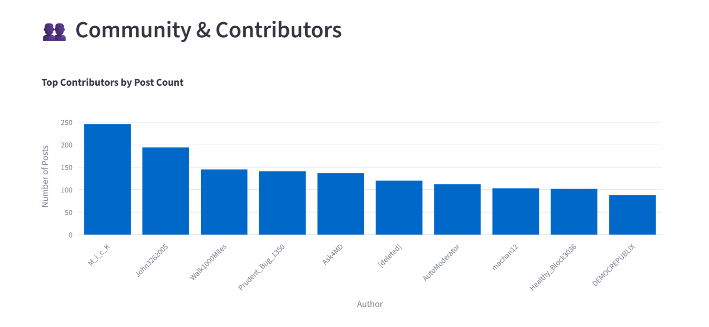
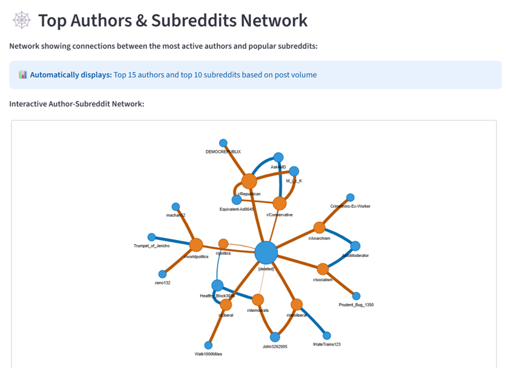
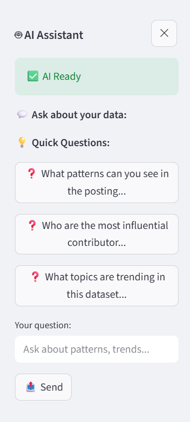
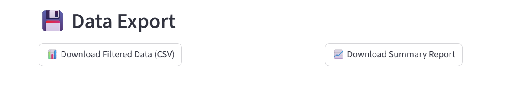

# Social Media Analytics Dashboard

An interactive investigative social media analytics dashboard built with Streamlit, designed to analyze social media data patterns, trends, and networks.

## 🎯 Project Overview

This dashboard provides foundational analytics capabilities for social media data investigation, focusing on:

- **Data Ingestion & Querying**: Load and filter social media posts by keywords, dates, and platforms
- **Summary Statistics**: Real-time metrics on post volume, contributors, and engagement
- **Time Series Analysis**: Visualize content spread and activity patterns over time
- **Topic Analysis**: Identify trending keywords and themes 
- **Community Analysis**: Discover key contributors and engagement patterns
- **Network Visualization**: Interactive network graphs showing author connections

## 🛠️ Tech Stack

- **Language**: Python 3.8+
- **Dashboard Framework**: Streamlit
- **Visualization Library**: Plotly
- **Network Analysis**: NetworkX + PyVis
- **Data Processing**: Pandas
- **Data Format**: JSONL (JSON Lines)

## 📊 Dataset

The dashboard works with Reddit data in JSONL format. Each line represents a social media post.

**Current Dataset**: 8,799 Reddit posts from July 2024 to February 2025, covering 3,599 unique authors.

## 🚀 Quick Start

### Prerequisites

- Python 3.8 or higher
- pip package manager
- Google AI API key (optional, for AI chatbot)

### Installation

1. **Clone or download the project files**
   ```bash
   git clone [https://github.com/dishachandaria/research-engineering-intern-assignment.git]

   ```
2. **Create a Virtual Environment & Install dependencies**:
   ```bash
   python -m venv venv
   venv\Scripts\activate
   pip install -r requirements.txt
   ```

3. **Verify data file**:
   Ensure `data/data.jsonl` exists in the project directory

4. **Get Gemini API key (optional)**:
   - Visit [Google AI Studio](https://aistudio.google.com/app/apikey)
   - Sign in and create a free API key
   - Create a new .env file in root directory of the project.

   ```bash
      GEMINI_API_KEY=your-api-key

   ```

5. **Run the dashboard**:
   ```bash
   streamlit run app.py
   ```

6. **Open your browser**:
   Navigate to `http://localhost:8501`

## 📱 Dashboard Features

### 🔍 Interactive Filters (Sidebar)
- **Keyword Search**: Filter posts by text content
- **Date Range**: Select specific time periods
- **Platform Filter**: Filter by social media platform
- **Subreddit Filter**: Focus on specific communities

### 📈 Summary Statistics
Real-time metrics that update based on filters:
- Total posts matching query
- Number of unique authors
- Average post score
- Total comments
- Date range coverage


### 📅 Time Series Analysis
- **Post Volume Over Time**: Interactive line chart showing activity patterns
- **Weekly Posting Rhythm**: Bar chart showing posting patterns by day of week


### 🏷️ Topic Analysis
- **Top Keywords**: Horizontal bar chart of most frequent terms
- **Keyword Trends**: Multi-line chart tracking keyword usage over time


### 👥 Community & Contributors
- **Top Contributors**: Bar chart of most active authors with engagement metrics


### 🕸️ Top Authors & Subreddits Network
Focused bipartite network visualization showing:
- **👤 Top 15 Authors**: Most active contributors (blue nodes)
- **📋 Top 10 Subreddits**: Most popular communities (orange nodes)
- **Edges**: Direct posting relationships between top authors and subreddits
- **Edge Thickness**: Represents posting frequency
- **Automatic Focus**: No configuration needed - shows most significant connections
- **Insights**: Identifies key players and their community participation patterns


### 🤖 AI Analytics Assistant (Floating Interface)
- **Sidebar Panel**: Clean chat interface that doesn't clutter main dashboard
- **Interactive Chat**: Ask questions about your data in natural language
- **Auto-Setup**: Automatically initializes with .env file configuration


### 💾 Data Export
- Download filtered dataset as CSV
- Generate and download summary analytics report


## 🏗️ Project Structure

```
├── app.py                 # Main Streamlit application
├── data_loader.py         # JSONL ingestion & preprocessing
├── analytics.py           # Data analysis & metrics calculation
├── visualizations.py      # Plotly charts & network graphs
├── gemini_chatbot.py      # AI Assistant
├── requirements.txt       # Python dependencies
├── data/
│   └── data.jsonl        # Social media dataset
└── README.md             # This file
```

## 🔧 Module Details

### `data_loader.py`
- **SocialMediaDataLoader**: Handles JSONL file ingestion
- **Features**: Deduplication, timestamp normalization, field extraction
- **Extracts**: Hashtags, domains, mentions, combined text for searching

### `analytics.py`
- **SocialMediaAnalytics**: Provides aggregation and analysis functions
- **Capabilities**: Summary stats, time series, keyword extraction, network building
- **Network Types**: Subreddit-based author connections

### `visualizations.py`
- **SocialMediaVisualizations**: Creates interactive Plotly charts
- **Network Visualization**: PyVis integration for interactive network graphs
- **Chart Types**: Line, bar, network graphs

### `app.py`
- **Main Application**: Streamlit dashboard orchestration
- **Features**: Filter management, layout organization, user interaction handling
